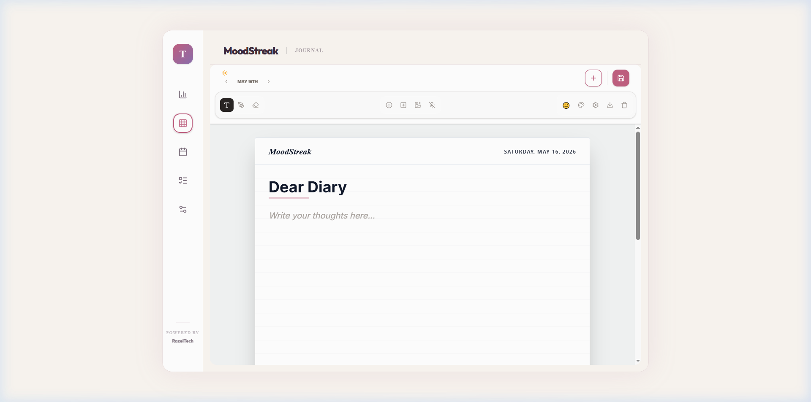
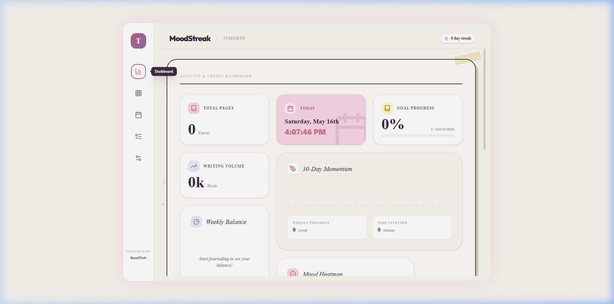

<div align="center">
  
  
  <br />
  
  <h1>✨ MoodStreak</h1>
  <p><b>Your Minimalist Digital Journal & Mood Tracker</b></p>
  
  <p>
    
    
    
    
  </p>
</div>

---

## 🌟 Overview

**MoodStreak** is a premium, minimalist digital journaling application designed for mindfulness and creative expression. Whether you prefer typing, speaking, or sketching, MoodStreak provides a beautiful, private space to capture your daily journey.

> "Journaling is like whispering to oneself and listening at the same time."

---

## 🚀 Key Features

### 🖋️ Creative Expression
- **Digital Ink**: Smooth, SVG-based hand-drawing and doodling directly on your diary pages.
- **Voice-to-Text**: Real-time speech recognition using the native **Web Speech API**—private, fast, and $0.00 cost.
- **Rich Text Editor**: Full formatting control with TipTap, including custom fonts and colors.

### 🎨 Personalization
- **Curated Themes**: Switch between Rose, Lavender, Sage, and Midnight aesthetics.
- **Stationery Options**: Choose from Ruled, Grid, Dotted, or Blank paper styles.
- **Dynamic Fonts**: Over 30+ premium typography options including Japanese ink styles and handwritten scripts.

### 📊 Insights & Productivity
- **Mood Tracking**: Log your daily emotions and visualize trends over time.
- **Planner**: Integrated daily task manager to align your goals with your reflections.
- **Streak System**: Stay motivated with a visual streak counter for consistent journaling.

### 🔒 Privacy First
- **Local Storage**: All data is stored securely on your device via **IndexedDB** (Dexie.js).
- **Vault Lock**: Optional 4-digit PIN protection for your private entries.
- **Zero Cloud**: No accounts, no tracking, no data leaves your browser.

---

## 📸 Screenshots

| Onboarding Experience | Daily Journaling |
|:---:|:---:|
|  |  |

| Insights Dashboard | Daily Planner |
|:---:|:---:|
|  |  |

---

## 🛠️ Tech Stack

- **Framework**: React 19 (Vite)
- **Styling**: Tailwind CSS 4 & Framer Motion
- **Database**: Dexie.js (IndexedDB)
- **Editor**: TipTap (ProseMirror)
- **Icons**: Lucide React
- **Drawing**: React Sketch Canvas
- **Analytics**: Recharts (Private, local only)

---

## ⚡ Getting Started

### Prerequisites
- Node.js (v18+)
- npm or yarn

### Installation
1. Clone the repository:
   ```bash
   git clone https://github.com/razeltech/moodstreak.git
   cd moodstreak
   ```

2. Install dependencies:
   ```bash
   npm install --legacy-peer-deps
   ```

3. Run the development server:
   ```bash
   npm run dev
   ```

4. Open [http://localhost:3000](http://localhost:3000) in your browser.

---

## 💎 Powered by RazelTech

MoodStreak is an original series project by **RazelTech**, focused on building high-fidelity, user-centric digital tools that prioritize privacy and premium aesthetics.

<div align="center">
  
  <br />
  <a href="https://razel.tech">Visit Razel.Tech</a>
</div>

---

## 📜 License

Distributed under the MIT License. See `LICENSE` for more information.

---

<div align="center">
  <sub>Built with ❤️ by <a href="https://razel.tech">RazelTech</a></sub>
</div>
